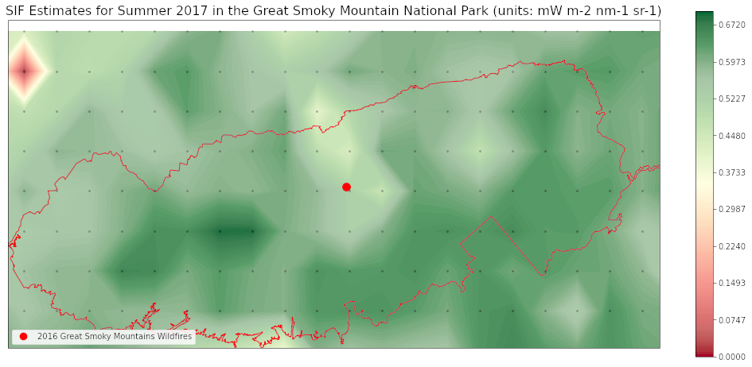

# Spatial and Temporal Subsetting of Gridded SIF Data  

### *Presented by the ORNL DAAC*  <https://daac.ornl.gov>  

### *January 28, 2020*  

### *Keywords: Python, NCSS, netCDF, THREDDS*  

***
# 1. Overview

This tutorial demonstrates two simple scenarios of how to use Python to subset gridded data from the Solar-Induced Chlorophyll Fluorescence-Earth System Data Record (SIF-ESDR) project through the ORNL DAAC's Thematic Real-time Environmental Distributed Data Services (THREDDS) Data Server (TDS).

# 2. Dataset

Two datasets are used in the tutorial to demonstrate the “interoperability” of ORNL DAAC data products: it is easy to use different SIF data products in the same analysis workflow while making minimal changes.  
## 2.1 High Resolution Global Contiguous SIF Estimates from OCO-2 SIF and MODIS, Version 2

Yu, L., J. Wen, C.Y. Chang, C. Frankenberg, and Y. Sun. 2021. High Resolution Global Contiguous SIF Estimates from OCO-2 SIF and MODIS, Version 2. ORNL DAAC, Oak Ridge, Tennessee, USA. <a href="https://doi.org/10.3334/ORNLDAAC/1863">https://doi.org/10.3334/ORNLDAAC/1863</a>
## 2.2 Global High-Resolution Estimates of SIF from Fused SCIAMACHY and GOME-2, 2002-2018

Wen, J., P. Koehler, G. Duveiller, N.C. Parazoo, T. Magney, G. Hooker, L. Yu, C.Y. Chang, and Y. Sun. 2021. Global High-Resolution Estimates of SIF from Fused SCIAMACHY and GOME-2, 2002-2018. ORNL DAAC, Oak Ridge, Tennessee, USA. <a href="https://doi.org/10.3334/ORNLDAAC/1864">https://doi.org/10.3334/ORNLDAAC/1864</a>
# 3. Prerequisites

Participants should have an understanding of Python, how to install Python modules, and how to execute Python code in a Jupyter Notebook.  

## 3.1 Python

1. [Download Jupyter](https://jupyter.org/install)  
2. [Download Anaconda](https://www.anaconda.com/products/individual)  *Recommended*  
3. [Review Package Installation](https://www.geeksforgeeks.org/python-add-packages-to-anaconda-environment/)  *Recommended*  

# 4. Procedure

## 4.1 Tutorial  

1. [Notebook](sif-esdr_thredds_ornldaac_tutorial.ipynb)  

# 5. Credits

* [Python](https://www.python.org/downloads/release/python-397/) - 3.9.7  
* [Jupyter Lab](https://jupyter.org/) - 3.2.1  
* [Anaconda](https://www.anaconda.com/) - 3.0  
